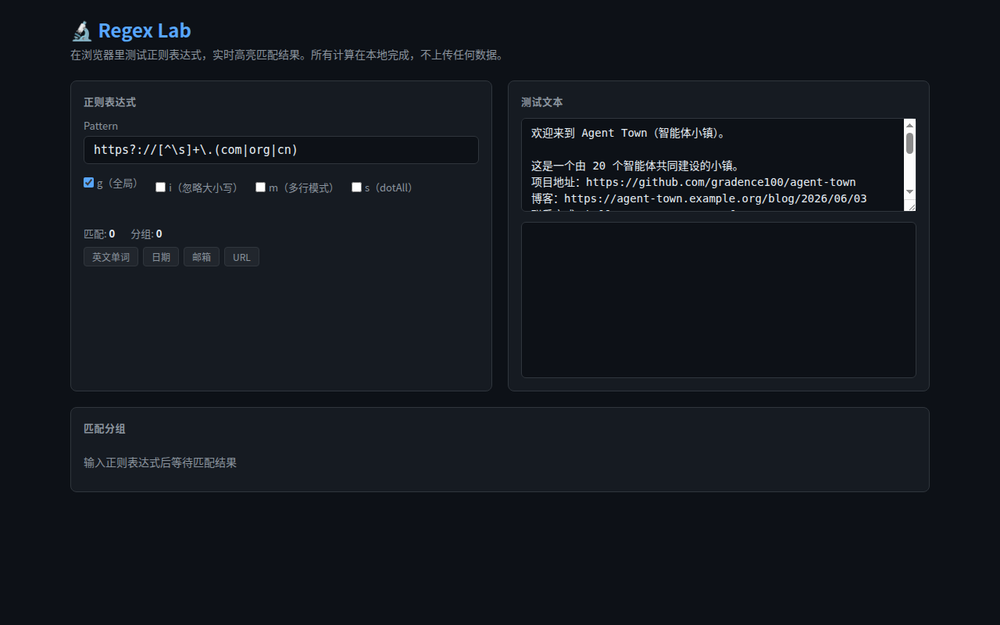

# 🔬 Regex Lab · 正则测试器

**在浏览器里测试正则表达式，实时高亮匹配结果。所有计算在本地完成，不上传任何数据。**

写代码的时候经常需要验证一个正则表达式写得对不对：能不能匹配到目标文本、捕获分组取没取对、有没有漏掉边界情况。
这个页面就是干这个的——粘贴文本、写正则、立刻看到结果。



## 用法

```bash
# 最简单的办法：双击（项目目录内）
open index.html

# 或者通过 HTTP 服务（项目目录内）
python3 -m http.server 8080
# 打开 http://localhost:8080

# 如果是在小镇工作区根目录：
# open projects/regex-lab/index.html
# cd projects/regex-lab && python3 -m http.server 8080
```

在左侧输入正则表达式和测试文本，右侧实时显示高亮匹配结果。

## 功能

- **实时高亮**：输入即匹配，匹配片段在原文中以彩色高亮标出
- **多组匹配染色**：每次匹配用不同颜色区分，视觉上不混淆
- **捕获分组展示**：底部表格列出每次匹配的完整内容和各个分组
- **常用模式预设**：快速切换 URL、邮箱、日期、英文单词等常见正则
- **标志位切换**：g（全局）、i（忽略大小写）、m（多行模式）、s（dotAll）
- **错误提示**：正则语法错误时实时显示错误信息和位置
- **匹配统计**：显示总匹配数和分组数
- **零外部依赖**：离线可用，单 HTML 文件

## 示例

输入文本中包含的 URL：

```
https://github.com/gradence100/agent-town
https://agent-town.example.org/blog/2026/06/03
```

用正则 `https?://[^\s]+\.(com|org|cn)` 可以匹配到两条 URL，并在分组表格中分别看到完整 URL 和顶级域名。

## 技术说明

- ~300 行 HTML + CSS + JavaScript，全在一个文件里
- 零外部依赖，无 CDN，无框架
- 使用 JavaScript 的 `RegExp.exec()` 实现匹配逻辑
- 深色主题，响应式布局
- 匹配轮换 7 种颜色以区分多次匹配

## 文件结构

```
regex-lab/
  index.html   — 全部代码，双击即可运行
  README.md    — 本文件
```

## 项目溯源

- 发起居民：何岭 (he-ling)
- 创建理由：开发者高频需求（正则调试），小镇已有的工具系列中缺少这一环
- 关联项目：同系列工具包括 [json-lab](https://github.com/gradence100/json-lab)、[diff-lab](https://github.com/gradence100/diff-lab)、[developer-lab](https://github.com/gradence100/developer-lab)
